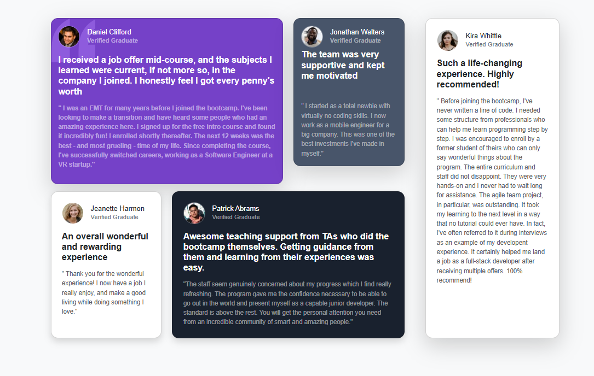
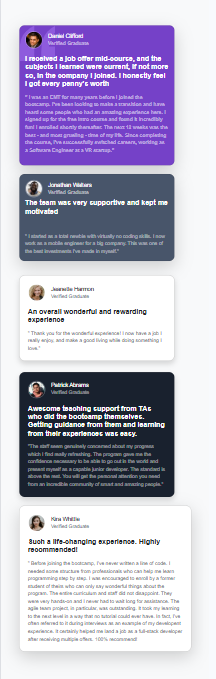

# Frontend Mentor - Testimonials grid section - Bootstrap

## Welcome! 👋

Thanks for checking out this front-end coding challenge.
This is a solution to the Testimonials grid section challenge on Frontend Mentor using Bootstrap-CSS and customcss properties.

#The challenge
  - Replaced custom CSS with Bootstrap’s card component (card-body,card-title,card-text) and utility classes (d-flex,me-3 for margin-right:1 rem , padding and text-alignment).
  - Used Bootstrap’s text utilities (e.g., text-muted, text-primary) for consistent typography.
  - Make use of responsive design using Bootstrap’s grid system and responsive classes
  - Added any custom CSS needed to achieve the required design fidelity.

- View the optimal layout for the site depending on their device's screen size
